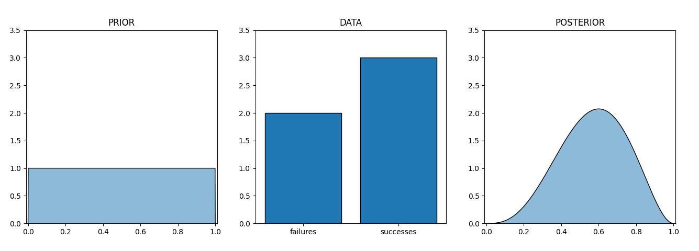
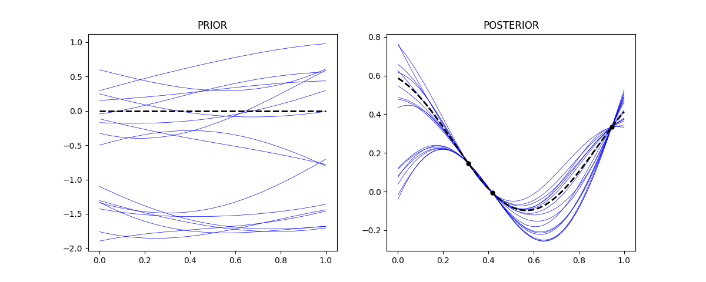

# INTRODUCTION

## Hyperparameter Optimization

Many machine learning algorithms attempt to construct a model by optimizing some objective function. The behavior of such a machine learning model can be defined through a set of parameters. The algorithm optimizes over some of these parameters in order to construct its model during the learning process. Other parameters, which define the behavior of the algorithm are generally not optimized during this process [@goodfellow2016deep]. These parameters are called *hyperparameters*, and must be selected by some other means. Examples of hyperparameters include the learning rate when training a neural network, the number of decision trees in a random forest, and the kernel used in a support vector machine [@luo2016review]. 

The setting of hyperparameters can often be the deciding factor between good results and state-of-the-art results [@hutter2015beyond]. Usually they are selected manually by rules of thumb [@claesen2015hyperparameter], but because of their importance, there has been much work into developing algorithms to optimally select such hyperparameters so that the learning process will produce the best model. Because we can view the success of the model produced by an algorithm as a function of its hyperparameters, we can apply optimization techniques to find optimal hyperparameters [@claesen2015hyperparameter]. 

A couple of the most basic optimization algorithms that can be used in hyperparameter optimization are grid search and random search, however these approaches can become inefficient if it is computationally expensive to evaluate the function being optimized (if the learning process is computationally expensive in the case of hyperparameter optimization) [@feurer2019hyperparameter]. One state-of-the-art optimization algorithm that performs well with costly function evaluations is *Bayesian optimization* [@snoek2012practical; @feurer2019hyperparameter; @wu2020practical]. Other types of algorithms can also be used, such as methods which maintain a population of possible solutions [@feurer2019hyperparameter]. 

## Bayesian Methods

In statistics and probability there are two common interpretations of the concept of probability; frequentist and Bayesian. The frequentist perspective views probability as the relative frequency of a certain event over a theoretically infinite amount of trials. The Bayesian perspective instead views probability as a degree of belief [@glickman2007basic; @goodfellow2016deep]. Such a belief is updated when new information is introduced to you. A common example of the difference in these perspectives is to imagine flipping a fair coin. Before you flip the coin, both perspectives would say there is a 50% chance of heads, however after the coin is flipped, but before you look at it, the Bayesian perspective would still say there is a 50% probability of heads whereas the frequentist perspective would not assign a probability, as the coin has already been flipped.

This idea is quantified through Bayes theorem, a fundamental concept in probability. The theorem states that, if $\Omega$ is the sample space, $H, D \in 2^{\Omega}$ are events, and $P: \Omega \rightarrow \mathbb{R}$ is a probability measure, then
$$ P(H | D) = \frac{P(D | H) P(H)}{P(D)}, $$ 
where $P(H | D)$ denotes the conditionaly probability of $H$ given $D$ and is defined as $P(H | D) = \frac{P(H \cap D)}{P(D)}$ (and similarly for $P(D | H)$) [@jospin2020hands]. While the theorem is still valid under a frequentist view of probability, the Bayesian perspective lends a more philosophically  impactful interpretation. The Bayesian interpretation of the theorem is that $P(H)$ is the *prior* probability (the prior probability ascribed to some hypothesis $H$), $P(D | H)$ is the *likelihood* (how likely observed data, $D$, is, given some hypothesis $H$), and $P(H | D)$ is the *posterior* probability (the adjusted belief about some hypothesis $H$, given data $D$). The idea is that your prior belief should be updated to a posterior belief based on new evidence.

The process of estimating some parameter, $\theta$, with this method would start with assigning a prior distribution over possible values this parameter could take ($P(\theta)$). Often, this prior is very spread out [@goodfellow2016deep]. Then, collecting informative data and calculating the likelihood of seeing such data given each possible value ($P(D | \theta)$). The posterior distribution would be calculated by multiplying the prior by the likelihood for each $\theta$, then scaling all values so that $P(\theta | D)$ is a valid probability distribution ($P(\Omega) = 1$ where $\Omega$ is the sample space) [@glickman2007basic]. Often, the set of values a parameter can take is continuous, so the equation for the posterior probability density function becomes
$$ p(\theta | D) = \frac{p(D | \theta) p(\theta)}{
	\int_{\mathbb{R}^n} p(D | \theta) p(\theta) d\theta}, $$
[@glickman2007basic; @jospin2020hands] where the posterior ($p(\theta | D)$) and prior ($p(\theta)$) are probability density functions over $\theta$ and $p(D | \theta)$ gives the relative likelihood of observed data given $\theta$ as the parameter value. Bayesian methods like this can be used to estimate parameters of a machine learning model, such as the coefficients in linear regression [@goodfellow2016deep]. 

{height=25% width=100%}

An example of Bayesian updating is shown in the above figure, where the parameter being estimated is the probability of a success in a Bernoulli trial (a Bernoulli trial is like a coin flip between success and failure, where the probability is not necessarily 50%). In the example, the prior distribution chosen is a uniform distribution over $[0, 1]$ (left). Then, five trials are run, with three successes and two failures (middle). Using this data, $D$, the posterior distribution is calculated (right). Notice that if the probability of success, $\theta$, is 0 or 1, then $P(D | \theta) = 0$, because it would be impossible to get a mix of successes and failures. Thus, the posterior distribution takes the value of 0 at both 0 and 1.

\pagebreak
# BACKGROUND

## Bayesian Optimization

One common black-box optimization algorithm is Bayesian optimization (BO). BO uses a probabilistic surrogate model of functions to model the objective function $f: \mathcal{X} \rightarrow \mathbb{R}$ (the function being optimized) [@li2020multi]. The goal is to find $x^* = \argmin\limits_{x \in \mathcal{X}} f(x)$ [@shahriari2015taking]. The algorithm begins by placing a prior over different possible functions that $f$ could be. Then, the algorithm iteratively selects a point $x_i \in \mathcal{X}$ based on some *acquisition function* (or a set of $x_i$'s), then calculates $f(x)$, which is used to update the surrogate model into a posterior distribution over possible functions $f$ could be, given the known function values [@shahriari2015taking].

While there are different possible surrogate models for BO, such as Bayesian neural networks, the most commonly used is a Gaussian process (GP) [@li2020multi; @snoek2012practical]. A GP is a set of random variables such that for any finite subset of them, their joint distribution is a Gaussian distribution [@rasmussen2003gaussian]. A GP, $f \sim \mathcal{GP}(m, k)$ is defined in terms of a kernel function $k : \mathcal{X} \times \mathcal{X} \rightarrow \mathbb{R}$ and a mean function $m : \mathcal{X} \rightarrow \mathbb{R}$ [@snoek2012practical]. Given a finite set of points, $X \in \mathcal{X}^n$, a GP provides a distribution for $f(X)$ that takes the following form: $f(X) \sim \mathcal{N}(m(X), K(X, X))$ (where $f(X), m(X)$ denotes the vector with $f, m$ applied to each element of $X$ and $K(X, X)$ is the covariance matrix where $K_{i, j} = k(X_i, X_j)$) [@rasmussen2003gaussian]. Once the values of $f$ for certain $x$ are known, a posterior GP can be calculated. If $\mathcal{D} = (X, y)$ are data/function evaluations such that for all $i$, $f(X_i) = y_i$, then the posterior GP, given by $\mathcal{GP}(m_{\mathcal{D}}, k_{\mathcal{D}})$, has the following closed form:
$$ m_{\mathcal{D}} (x) = m(x) + K(X, x)^T K(X, X)^{-1} y $$
$$ k_{\mathcal{D}} (x, x') = k(x, x') - K(X, x)^T K(X, X)^{-1} K(X, x') $$

[@rasmussen2003gaussian; @shahriari2015taking; @feurer2019hyperparameter]. This follows from conditional probability in multivariate Gaussians.

{height=25% width=90%}

 The figure above shows a GP before and after being updated with function values. GP's can also be computed with an assumption of Gaussian noise at function evaluations [@rasmussen2003gaussian]. One example of Gaussian processes being used is in estimating pollution levels in Salt Lake City with noisy sensor data [@kelly2020community].

Another important part of BO is the selection of the acquisition function. An acquisition function uses the posterior surrogate model in order to select new points to evaluate the objective function at. One common function is expected improvement, where the $x$ to query next is found by $x_{n+1} = \argmax\limits_{x \in \mathcal{X}} E[\max (f_{\min} - Y, 0)]$, where $Y$ is the current distribution of $f(x)$ and $f_{\min} = \min\{f(x_1), f(x_2), ... , f(x_n)\}$ [@jones1998efficient] ($E[\cdot]$ denotes expected value). Another approach is select $x$ by maximizing (or minimizing) an upper-confidence bound (or lower-confidence bound) (UCB) [@srinivas2009gaussian]. A more recent acquisition function is the max-value entropy search, where $x$ is selected with $x_{n+1} = \argmax\limits_{x \in \mathcal{X}} I(Y, f^*)$, where $f^*$ is the global minimum of a function drawn from the surrogate model and $I(\cdot, \cdot)$ denotes mutual information (a measure of how much one of the random variables tells you about the other) [@wang2017max].

## Bayesian Neural Networks

*Artificial Neural Networks* (ANNs) are a family of machine learning models. The simplest kind of ANN is called a multilayer perceptron (MLP) and is parameterized by weights, $W_i$, and biases, $b_i$. An MLP constructs a function $f: \mathbb{R}^n \rightarrow \mathbb{R}^m$ through a series of intermediary vectors $h_i \in \mathbb{R}^p$ that can be defined like so:
$$ h_{i+1} = \phi (W_i h_i + b_i), $$
where $h_0 = x$ is the input, $h_q = f(x)$ is the output, and $\phi: \mathbb{R} \rightarrow \mathbb{R}$ is a non-linear activation function [@goodfellow2016deep; @jospin2020hands]. The number of layers, the size of those layers, the choice of an optimization function, and the initialization of weights are examples of hyperparameters. During the training process, there are other hyperparameters, such as choice of optimization algorithm and number of epochs of training [@luo2016review]. The number of epochs when training an ANN is simply the number of times the optimization algorithm loops through the dataset during the optimization process.

Usually, the parameters of an ANN, denoted by $\theta$ (the weights and biases), are specific values, however in something called a *Bayesian neural network* (BNN), $\theta$ is modeled by a probability distribution [@jospin2020hands]. In a BNN, a prior distribution is placed over $\theta$, and a posterior distribution is calculated for $\theta$ given some data using Bayes theorem. Because some of the calculations involved are difficult, often Markov chain Monte Carlo or Variational methods are used to train BNNs in practice [@jospin2020hands].

## Multi-Fidelity Bayesian Optimization

With most hyperparameter optimization algorithms, including BO, a function evaluation means computing the entire machine learning algorithm [@goodfellow2016deep]. This can be very costly. In order to combat this cost, variants of BO have been introduced which allow for less expensive approximations of the objective function to be queried in order to efficiently find optimal values. These approximations are known as low-fidelity function evaluations [@huang2006sequential]. BO approaches that support these evaluations are known as *multi-fidelity Bayesian optimization* algorithms [@wu2020practical].

## The Bandit Problem

The bandit problem asks the player to find, given a set of unknown probability distributions, $\{D_1, D_2, ... , D_k\}$, the one with the highest expected value. The player is allowed to draw $r_i \sim D_j$ from one of the distributions at each turn; the value drawn is called the reward [@kuleshov2014algorithms]. Bandit algorithms are concerned with finding optimal ways to select which distribution to draw from in order to maximize the reward. Because rewards are drawn from unknown distributions, they can model noisy function evaluations like in *Gaussian process bandit optimisation with multi-fidelity evaluations* by Kandasamy *et al.* [@kandasamy2016gaussian].

\pagebreak
# CURRENT METHODS

## Hyperband

In *Hyperband: A Novel Bandit-Based Approach to Hyperparameter Optimization*, a 2018 journal article, hyperparameter optimization is phrased as an infinitely armed bandit problem [@li2017hyperband]. The article introduces a novel algorithm called the hyperband algorithm. hyperband iteratively calls another algorithm called successive halving with different parameters each time based on a finite amount of resources. The successive halving algorithm starts with a batch of canditate $x$ values, then evaluates them at each fidelity, throwing away poor performing $x$ values as the fidelity increases [@jamieson2016non]. Hyperband performs a geometric search over different runs of successive halving, where the proportion of canditate $x$ values dropped is varied (along with the corresponding number of starting $x$ values) [@li2017hyperband].

## MF-GP-UCB

In *Gaussian Process Bandit Optimisation with Multi-fidelity Evaluations*, a 2016 paper, The MF-GP-UCB algorithm is introduced [@kandasamy2016gaussian]. MF-GP-UCB stands for multi-fidelity, Gaussian process, and upper confidence bound respectfully. MF-GP-UCB assumes that the objective function at different fidelities takes the form of an infinitely armed bandit drawn from a GP. The algorithm then models each of these different fidelities with seperate GPs. Then, the algorithm selects the next point to query with a modified UCB acquisition function that first attempts ot upperbound the acquisition function with high probability for each fidelity, then selects the next $x$ value to query the objective function based on the tightest of these bounds. The fidelity at which to query is selected by finding the lowest fidelity where the GP has a standard deviation at the chosen $x$ that is above some threshold determined by the level of fidelity and iteration the algorithm is on [@kandasamy2016gaussian].

## MF-MES

In *Multi-fidelity Bayesian Optimization with Max-value Entropy Search and its Parallelization*, a 2020 paper in ICML, the MF-MES algorithm is introduced [@takeno2020multi]. The algorithm models every fidelity with one GP, where the kernel used takes different fidelities into account. A variant of max value entropy is used as the acquisition function, where the $x$ and fidelity to query next is selected based on the mutual information of the optimal value at the highest fidelity and the distribution of the GP at $x$ with the specified fidelity, adjusted by the cost of that fidelity [@takeno2020multi].

## BMBO-DARN

In *Batch Multi-Fidelity Bayesian Optimization with Deep Auto-Regressive Networks*, a conference paper published in NeurIPS 2021, the BMBO-DARN algorithm is proposed [@li2021batch]. BMBO-DARN uses a series of BNNs instead of a GP as a surrogate model for BO. This is done so that more complex relationships between different fidelities can be expressed. The series of BNNs model distributions of the objective function at different fidelities. Each BNN in the sequence takes as input the output of all previous BNNs as well as the original input. The paper also proposes a batch acquisition function, which allows for a batch of $x$ values with which to evaluate the objective function to be proposed (instead of a single $x$ value). BMBO-DARN shows improvement over various other approaches to multi-fidelity optimization [@li2021batch].

## Other Notable Approaches

Another notable multi-fidelity BO algorithm is MF-PES, which models different fidelities with a convolved multi-ouput GP, and uses a modified predicive entropy search for its acquisition function [@zhang2017information]. On the other hand, DNN-MFBO models different fidelities with ANNs that have a probabalistic final layer [@li2020multi]. In [@wu2020practical], the taKG acquisition function is introduced, which takes into account how an observation at a certain fidelity affects all the posterior at lower fidelites at that value. A different algorithm, called MF-MI-Greedy, explores low fidelity evaluations, before picking an $x$ value to query at a high fidelity [@song2019general].

\pagebreak
# CONCLUSION

Hyperparameters exist in almost every machine learning algorithm [@goodfellow2016deep]. Being able to optimized hyperparameters allow the construction of better machine learning models. One state-of-the-art approach is known as Bayesian optimization, and is instantiated in many different ways [@feurer2019hyperparameter]. One flavor that has gained popularity is multi-fidelity Bayesian optimization. In order to understand the methods used in these algorithms, many difficult math concepts must be understood. This essay has provided an overview of a few of these concepts and related them to current multi-fidelity hyperparameter optimization algorithms.

\pagebreak
# REFERENCES